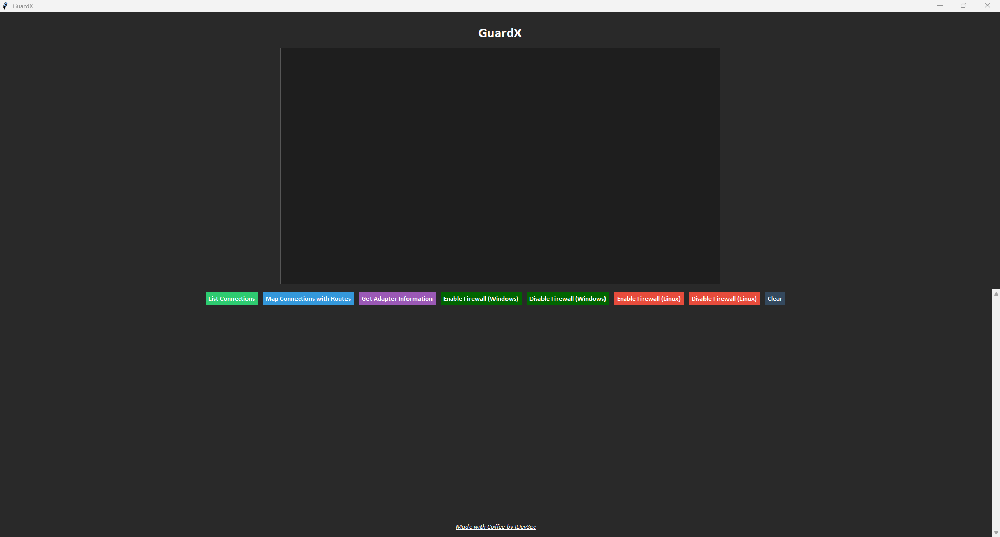

# **GuardX: Comprehensive Network and Firewall Management Tool**

**GuardX** is an advanced network and firewall management tool, designed to simplify network monitoring and control on both **Windows** and **Linux** systems. Built using **Python** and **Tkinter**, this tool provides a sleek, user-friendly graphical interface to manage active network connections, routing details, adapter information, and firewall settings.

---

## **Features**

### **1. List Active Network Connections**
- Displays a detailed list of all active network connections:
  - **PID**: The process ID tied to the connection.
  - **Local Address**: The local IP and port.
  - **Remote Address**: The external IP and port (if connected).
  - **Status**: Connection state (`ESTABLISHED`, `LISTEN`, etc.).
- Helps identify suspicious or unnecessary active connections.

### **2. Map Network Routes**
- Provides routing table information, showcasing how network traffic flows.
- Platform-specific commands:
  - **Linux**: Uses the `netstat -rn` command to retrieve routing details.
  - **Windows**: Utilizes `psutil.net_if_stats` to fetch interface stats and routing info.
- Assists in troubleshooting network route issues or analyzing data paths.

### **3. Get Network Adapter Information**
- Displays detailed information about all network adapters on the system, including:
  - **Adapter Name** (e.g., `eth0`, `Wi-Fi`).
  - **IP Address**: Assigned IP for the adapter.
  - **Netmask**: Subnet mask for the adapter.
  - **Broadcast IP**: Broadcast address used by the adapter.
- Useful for debugging local network issues or verifying configurations.

### **4. Firewall Management**
#### **Windows**
- **Enable/Disable Windows Firewall**:
  - Enable: `netsh advfirewall set allprofiles state on`.
  - Disable: `netsh advfirewall set allprofiles state off`.
  
#### **Linux**
- **Enable/Disable UFW (Uncomplicated Firewall)**:
  - Enable: `ufw enable`.
  - Disable: `ufw disable`.

### **5. User-Friendly GUI**
- **Tkinter-based GUI**:
  - Buttons for all features, organized in a neat frame.
  - **Scrollable Text Output**: Displays detailed results for actions.
  - **Clear Button**: Clears all displayed output.
  - A footer with a clickable hyperlink to the [IDevSec LinkedIn page](https://www.linkedin.com/company/idevsec).

---

## **Installation**

### **Prerequisites**
- **Python 3.x**: Install Python 3 or higher.
- **Dependencies**: Install required libraries using `requirements.txt`.

### **Steps**
1. Clone or download the repository:
   ```bash
   git clone https://github.com/idevsec/GuardX.git
   cd GuardX
   ```
2. Open a terminal or command prompt in the project directory.
3. Install dependencies:
   ```bash
   pip install -r requirements.txt
   ```

### **Run the Application**
1. Navigate to the project directory.
2. Execute:
   ```bash
   python GuardX.py
   ```
3. The GuardX graphical interface will open.

---

## **Screenshots**

### **Main Interface**


*Note*: Ensure to run GuardX with the necessary permissions (Administrator/Root) to access firewall and network management features.

---

## **Proposed Solutions for Common Scenarios**

1. **Monitoring Suspicious Connections**:
   - Use the **List Connections** feature to view all active connections.
   - Cross-check unknown PIDs with your system processes for any unusual activity.

2. **Diagnosing Network Traffic**:
   - Use **Map Connections with Routes** to analyze the routing table.
   - Helps in diagnosing packet routing issues.

3. **Debugging Adapter Configuration**:
   - Use **Get Adapter Information** to ensure proper adapter settings (IP, Netmask, Broadcast).

4. **Firewall Issues**:
   - **Windows**: Quickly enable/disable the firewall without needing to navigate through system settings.
   - **Linux**: Control the firewall state with a single click, provided UFW is installed.

5. **Permissions Error**:
   - Run the script with administrator/root privileges if required.

---

## **Known Issues**
1. **Permissions**: Ensure the script is run as Administrator (Windows) or with sudo/root privileges (Linux) for firewall settings.
2. **Platform Limitations**: The script relies on platform-specific tools:
   - `netsh` for Windows.
   - `ufw` for Linux.
   - Unsupported platforms may require adjustments.

---

#### **Contributing**
We welcome contributions to enhance GuardX! If you'd like to contribute:
1. Please review our [CONTRIBUTING.md](/CONTRIBUTING.md) file for guidelines on how to submit issues or pull requests.
2. Ensure that your contributions adhere to our [Code of Conduct](/CODE_OF_CONDUCT.md).

---

#### **Code of Conduct**
All contributors are expected to adhere to our [Code of Conduct](/CODE_OF_CONDUCT.md). It outlines the standards for a positive and inclusive environment for collaboration.

---

## **Acknowledgements**
**GuardX** is an initiative by the **IDevSec Team**, dedicated to simplifying network and firewall management through intuitive tools and innovative solutions.

Special thanks to **[psutil](https://psutil.readthedocs.io/en/latest/)** and **[tkinter](https://docs.python.org/3/library/tkinter.html)** for providing powerful tools to help us build this application.

---

## **Credits**
**GuardX** was developed by the **IDevSec Team**:
- [**Rashideo Benvansh**](https://www.linkedin.com/in/rashideo-benvansh): Concept and Idea.
- [**Kashish Kanojia**](https://www.linkedin.com/in/cyberfascinate): Lead Developer.
- [**Suvam Debnath**](https://www.linkedin.com/in/suvamdebnath): Developer.
- [**Cyril Nelson Francis**](https://www.linkedin.com/in/cyril-n-francis-cybersecurity-enthusiast): Developer.

Special thanks to the **[IDevSec Team](https://www.linkedin.com/company/idevsec)** for their continued collaboration.

---

## **License**
This project is licensed under the MIT License. See the [LICENSE](/LICENSE) file for details.